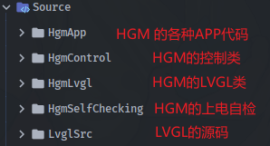
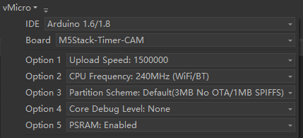
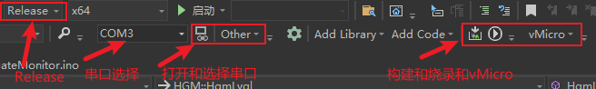
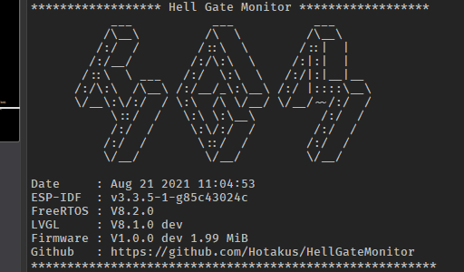

# Hell Gate Monitor（HGM）
### 微型的MC风格多功能无线监控副屏  

---
[](./LICENSE)
[](Hardware)
[](https://space.bilibili.com/341974201)
[](https://space.bilibili.com/341974201)
[](https://visualstudio.microsoft.com/zh-hans/vs/)


---

 
---

### 基本信息：

---
> 主控: &emsp; &emsp; ESP32-PICO-D4，240Mhz，4MB Flash，512KB RAM  
> PSRAM: &emsp;ESP-PSRAM64，8MB SPI RAM  
> 电源IC: &emsp; &nbsp;BQ25896  
> IMU: &emsp; &emsp; &nbsp;MPU6050  
> USB串口:&emsp;CP2104    
> LDO芯片:&emsp;XC6210B332，700mA  
> 屏幕: &emsp; &emsp; 1.14英寸 135x240分辨率IPS  
> 锂电池:&emsp; &nbsp; 700mAh  
> 
> LVGL: &nbsp;&nbsp; &nbsp; &nbsp; &nbsp;V8.1.0 dev

从代码上看，ESP32系列只要支持PSRAM，则代码通用。 

---
### 基本功能：
>通过蓝牙安卓APP进行Hell Gate Monitor 的 __实时控制与WiFi配置等__  
>通过WiFi对局域网PC进行实时的 __硬件信息监控__ 显示（通过我的另外一个项目 
> [HGMC]() 后续考虑开发Linux版的
> ）  
>通过WiFi进行PC的 __屏幕投屏__  
>通过WiFi进行实时的 __天气与时钟显示__  
>通过WiFi进行实时的 __B站基本信息显示__（通过我的蓝牙APP进行B站配置）  

__蓝牙默认名：__ HellGateMonitorBT  
Bluetooth 和 Wi-Fi TCP 为本人规定固定格式的json数据包组成，采用命令代码方式进行数据交互
，可通过命令和固件定制，添加更多功能。  

[HGM 的蓝牙JSON数据包格式](./Source/HgmApp/HgmBT/README.md)  
[HGM 的WiFi TCP JSON数据包格式]

---

### 项目克隆：
项目使用了 __子模块__，clone 时要加 __--recurse-submodules__  
一、需要为你的Github账号配置 SSH key（方法请百度）
```shell
git clone --recurse-submodules git@github.com:Hotakus/HellGateMonitor.git
```
二、不需要配置 SSH key
```shell
git clone --recurse-submodules https://github.com/Hotakus/HellGateMonitor.git
```

---

### 项目基本结构：
下位机所有的程序源码都放在Source文件夹下  
  
LVGL源码采用子模块的方式引用到此项目中，这样可以方便的对LVGL版本进行实时同步更新。  
另外，由于此项目使用的是Arduino平台，所以在使用此项目前，你应该先安装指定库：
* ArduinoJson （解析/打包JSON数据）
* TFT_eSPI （屏幕驱动库）
* TJpg_Decoder（JPG解码库）
* MPU6050_light （MPU6050 轻量库）  

另外，你应该在Arduino的 File-->preferences中 添加乐鑫的ESP32板包：
```shell
https://dl.espressif.com/dl/package_esp32_index.json
```

当然，不能直接在Arduino的官方IDE中直接编译项目，因为它的项目管理能力太差了。
我们使用Visual Studio 2019作为开发环境，这里也不推荐vscode，理由同Arduino官方IDE。

---

### 开始项目编译：
如果上述工作都正确完成了，那么接下来可以编译项目了。  
首先，你应该在 VS2019 的“扩展”--“管理扩展”中，搜索并添加Arduino的扩展，
扩展安装方法不赘述，关于VS2019的Arduino扩展，请自行摸索一遍，再对项目使用。

现在，我默认你已经搞清楚了Arduino的扩展，接下来找到vMicro按照我下图进行简单配置。

  
我之所以选这个是因为这个开发板环境和此项目几乎完美契合。

然后，将项目Debug改为Release，不然项目跑不起来。  
__最后：__  


如果编译烧写正常，那么串口会出现以下信息(115200)，则项目构建完成：  


---
