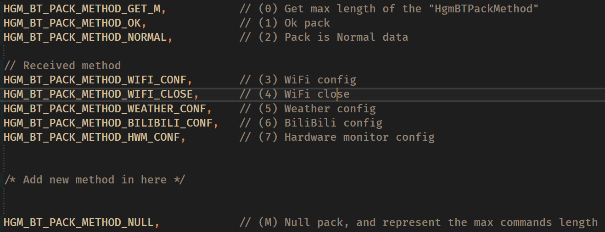

# HgmBT

HGM的蓝牙数据包格式(JSON)

---

## 下位机接收格式

|------|数据头标识|数据类型    |数据块      |
|:----:|:-------:|:--------:|:----------:|
| **Key**|Header   |DataType  |Data        |
| **Value**|Hgm  |dt (见下文)|data(见下文)|

可以自己添加命令实现更多功能(详见 [BT代码](./HgmBT.h) )



## 数据包例子：
**获取命令长度M** （DataType == 0）
```json
{
  "Header": "Hgm",
  "DataType": "6",
  "Data": ""
}
```
返回长度M

**普通数据接收** （DataType == 1）
```json
{
  "Header": "Hgm",
  "DataType": "1",
  "Data": "Hello world! HellGateMonitor!!!"
}
```

普通数据模式下，HGM接收后在串口终端输出相应Data信息

**WiFi配置和开启** （DataType == 3）

```json
{
  "Header": "Hgm",
  "DataType": "0",
  "Data": {
    "ssid": "xxx",
    "password": "xxx"
  }
}
```

**WiFi关闭** （DataType == 4）

```json
{
  "Header": "Hgm",
  "DataType": "1",
  "Data": "Any content"
}
```

**天气等信息配置** （DataType == 5）  
API详见“ [和风天气API](https://dev.qweather.com/docs/api/) ”，若只是使用则不需要了解

```json
{
  "Header": "Hgm",
  "DataType": "2",
  "Data": {
    "id": "101010300",
    "adm": "Beijing",
    "adm2": "Beijing",
    "location": "Chaoyang",
    "lat": "39.92149",
    "lon": "116.48641",
    "key": "xxxxxxxxxxxxxxx"
  }
}
```

**B站配置** （DataType == 6）

```json
{
  "Header": "Hgm",
  "DataType": "3",
  "Data": {
    "uid": "xxx"
  }
}
```
**配置硬件监控UI** （DataType == 7）
```json
{
  "Header": "Hgm",
  "DataType": "5",
  "Data": {
    "default" : "1",
    "leftTop" : "CPU",
    "leftBottom" : "GPU",
    "rightTop" : "Memory",
    "rightBottom" : "HardDisk"
  }
}
```
**default** 为 1 代表使用默认配置，为 0 代表使用新配置，并覆写配置文件  
**Data** 候选有：CPU、GPU、Memory、HardDisk、Network、Fans(风扇)

<br>

#### 中间可以添加更多命令........

<br>


**空数据包** （DataType == M）

```json
{
  "Header": "Hgm",
  "DataType": "M",
  "Data": ""
}
```

---

## 上位机接收格式

同 “下位机接收格式”

---

下位机接收成功返回给对方一个JSON数据包：  
OK（DataType == 1）

```json
{
  "Header": "Hgm",
  "DataType": "1",
  "Data": "ok"
}
```

---


